# OpenTelemetry - project for Environment of Services Implementation course

## 1. Introduction

This project's purpose is to construct and perform a simple case study, that would allow to get acquainted with OpenTelemetry technology, which is an open source observability framework that provides IT teams with standardized protocols and tools for collecting and routing telemetry data.

**Authors**:

- Mateusz Cyganek
- Szymon Ryś
- Piotr Socała
- Rafał Tekielski


## 2. Theoretical background/technology stack

### OpenTelemetry

OpenTelemetry stands as a cutting-edge Observability framework and toolkit meticulously crafted to orchestrate telemetry data like **traces**, **metrics**, and **logs**. Significantly, OpenTelemetry operates independently of vendors and tools, allowing integration with a diverse range of Observability backends, including both open-source solutions like Jaeger and Prometheus, as well as commercial offerings.

Unlike conventional observability backends such as Jaeger or Prometheus, OpenTelemetry takes a different approach. It is primarily focused on the lifecycle of telemetry data—generation, collection, management, and export. A core objective of OpenTelemetry is to simplify the process of instrumenting applications or systems, regardless of their language, infrastructure, or runtime environment. Importantly, OpenTelemetry leaves the storage and visualization of telemetry data to other specialized tools, promoting flexibility and adaptability in observability management.

#### Traces

Traces give us the big picture of what happens when a request is made to an application. Whether your application is a monolith with a single database or a sophisticated mesh of services, traces are essential to understanding the full “path” a request takes in your application.

They are represented by **spans**, which are the units of work or operation. In OpenTelemetry, they include the following information:

- Name
- Parent span ID (empty for root spans)
- Start and End Timestamps
- Span Context
- Attributes
- Span Events
- Span Links
- Span Status

#### Metrics

A metric is a measurement of a service captured at runtime. The moment of capturing a measurements is known as a metric event, which consists not only of the measurement itself, but also the time at which it was captured and associated metadata.

#### Logs

A log is a timestamped text record, either structured (recommended) or unstructured, with metadata. Of all telemetry signals, logs have the biggest legacy. Most programming languages have built-in logging capabilities or well-known, widely used logging libraries. Although logs are an independent data source, they may also be attached to spans. In OpenTelemetry, any data that is not part of a distributed trace or a metric is a log. For example, events are a specific type of log. Logs often contain detailed debugging/diagnostic info, such as inputs to an operation, the result of the operation, and any supporting metadata for that operation.

## 3. Case study concept description


The performed case study will focus on the demonstration of network traffic and performance measurement and tracking provided by OpenTelemetry framework and its observability backends, like Jaeger. In this simple example, we will use OpenTelemetry to observe the internal state of the system consisting of two services that share dummy resources to fetch, and which will be used to simulate traffic within a system by sending some automated HTTP requests to them by Locust clients.

System will be configured to communicate with the observability backends like Jaeger, and Grafana. User will be able to access those tools to analyze and monitor data flow within the application and for example find potential problems within the system's performance.


## 4. Solution architecture

<center>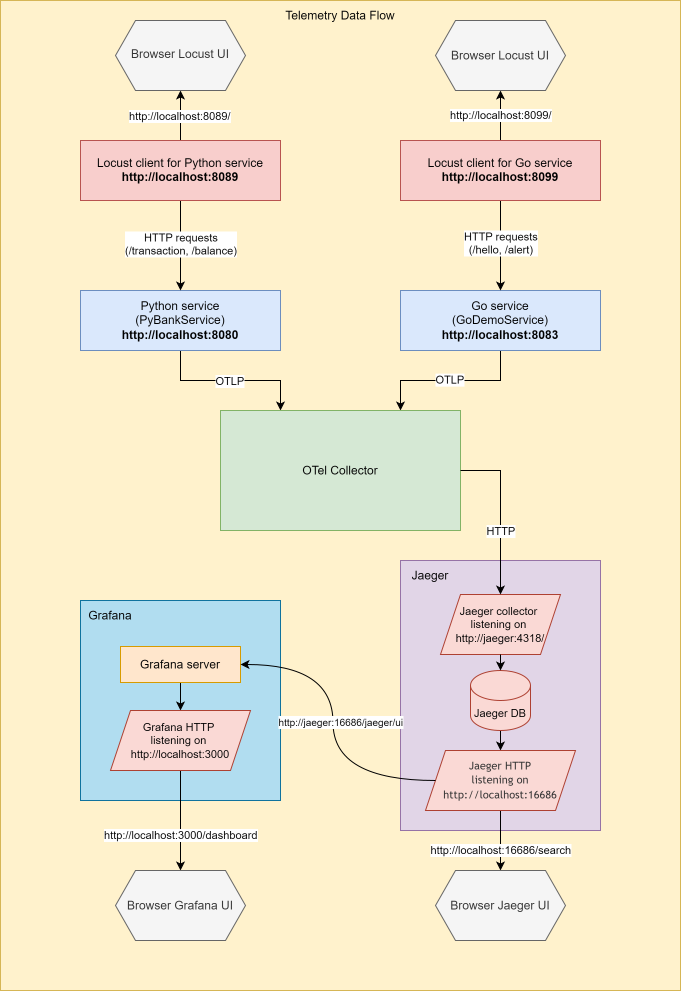</center>

<br>

The system made for the purpose of this case study consists of:

* 2 services, which provide simple APIs handling incoming HTTP requests:
    * Go service (`GoDemoService`)
      [DOCUMENTATION](http://localhost:8084/),  URL = [http://localhost:8083](http://localhost:8083)

    * Python service (`PyBank`)
      [DOCUMENTATION](http://localhost:8081/),  URL = [http://localhost:8080](http://localhost:8080)


* Services are instantiated and configured as Docker containers within a Docker Compose setup to be able to communicate with the system.
* Both services are flooded with HTTP requests created by two Locust clients, which simulates network traffic within the application.
  [Locust configuration](https://docs.locust.io/en/stable/configuration.html)
* Docker Compose are also responsible for connecting generated metrics with observability backends, to display them in the user-friendly form. Those backends are Jaeger  and Grafana.

## 5. Environment configuration description

The project was created using Docker. This approach allows for minimizing the requirements needed to run the project. 
The entire application can be launched with a single Docker command 'docker-compose up', which installs all the 
necessary dependencies and creates separate images for each component.

### Benefits:
 * Using Docker provides environmental isolation and facilitates dependency management.
 * Scaling the project is easy by running additional service containers.
 * The project is easy to deploy on different platforms due to its portability.

### Docker deployment requirements:

* Docker
* Docker Compose v2.0.0+
* 2 GB of RAM for the application

## 6. Installation method

### Prerequisites:

* Docker: Ensure Docker is installed and running on your system. You can download Docker from the official website: https://docs.docker.com/get-docker/
* Docker Compose: Install Docker Compose, a tool for managing multi-container Docker applications. Download instructions are available at: https://docs.docker.com/compose/install/
* System Resources: Ensure your system has at least 2 GB of RAM available to run the application.

### Installation Steps:

#### 1. Clone the Project Repository:
```bash
git clone https://github.com/mrrys00/sem08-cloud-shared-services-project.git
```

#### 2. Navigate to the Project Directory:
```bash
cd sem08-cloud-shared-services-project
```

#### 3. Start the Application:
```bash
docker-compose up
```

#### Verification
To verify that the application is running correctly, you can check the logs:
```bash
docker-compose logs
```

#### Stop Application
To stop the application and remove the containers, run:
```bash
docker-compose down
```

## 7. Demo deployment steps:

## Configuration set-up

### 1. Configuration set-up

Just start the application by running the following command in the project directory:

```bash
docker-compose up
```

If you haven't installed the repository yet, go to point 6 (Installation Method) in this readme.

### 2. Services preparation

#### Go Service
* Go to Locust Web UI  at [localhost:8099](http://localhost:8099/) 
* set Number of users (peak concurrency)
* set Ramp up (users started/second)
* press start button

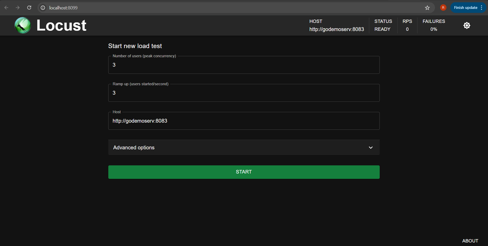

#### Python Service

* Go to Locust Web UI  at [localhost:8089](http://localhost:8089/)
* set Number of users (peak concurrency)
* set Ramp up (users started/second)
* press start button

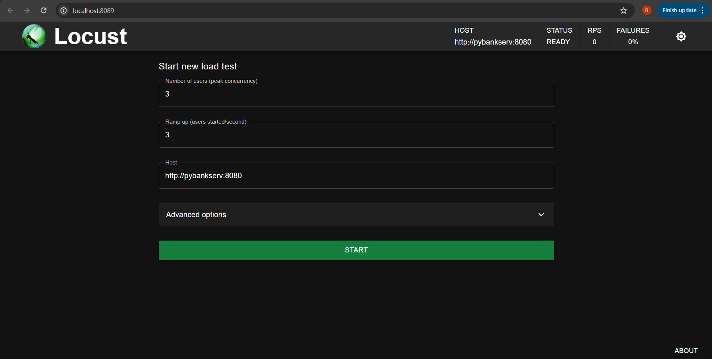

### 3. Observe telemetry

#### Jeager
* Go to Jeager UI http://localhost:16686/jaeger/ui/search

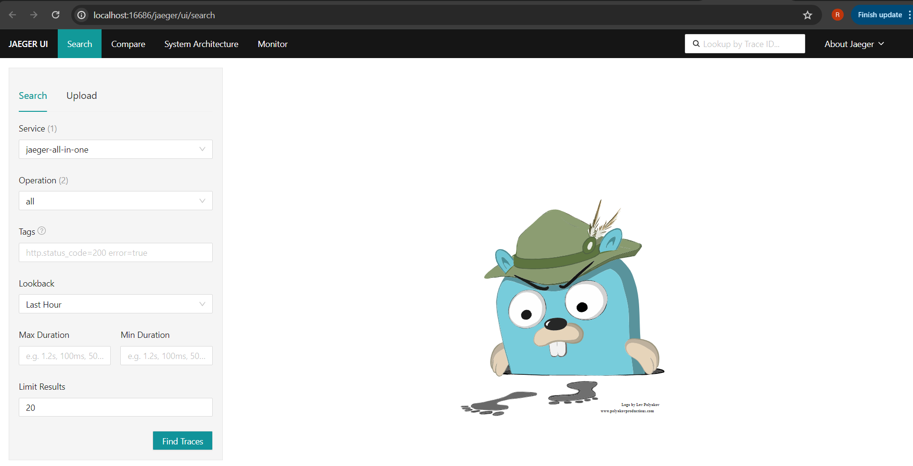

* On the left side of the page Select Service "godemoservice" or "pybankserve" as Service
* Select operations: all
* Now you can observe various kinds of dashboards i Jeager UI

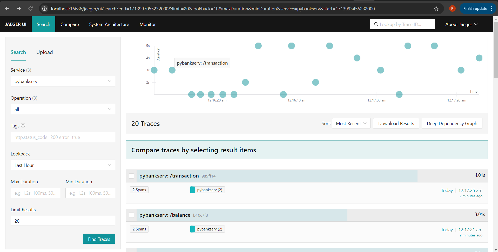

#### Grafana
* Go to Grafana UI http://localhost:3000/

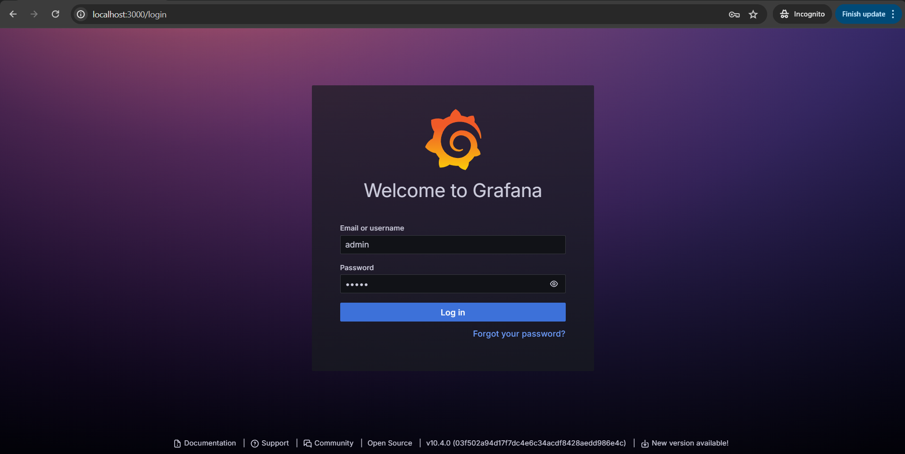

* On the login page enter credentials:
  * login: admin
  * password: admin

* On the left side of the page choose Dashboard from menu:

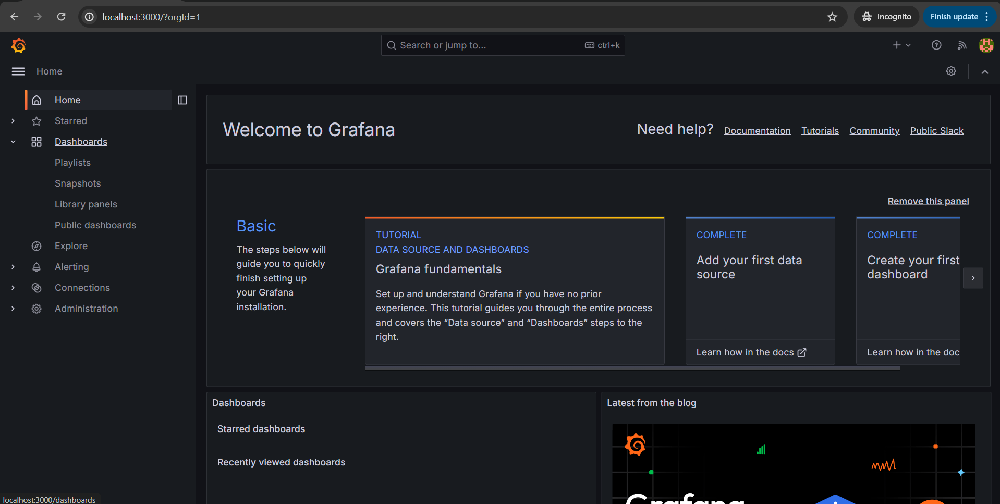

* On the top right side click "New" and then "New dashboard"

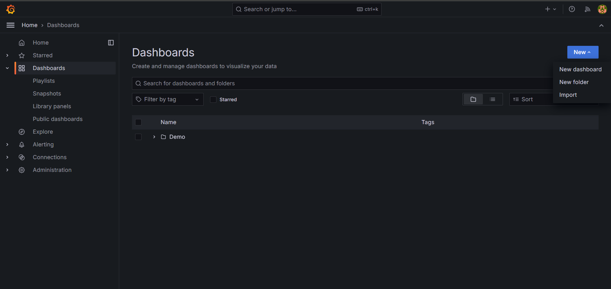

* Then click "Add visualization"

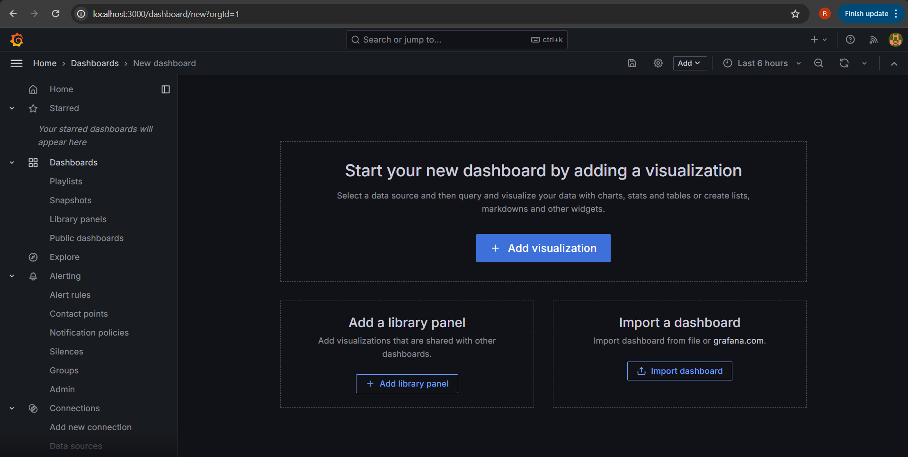

* Select datasource: click on Jeager

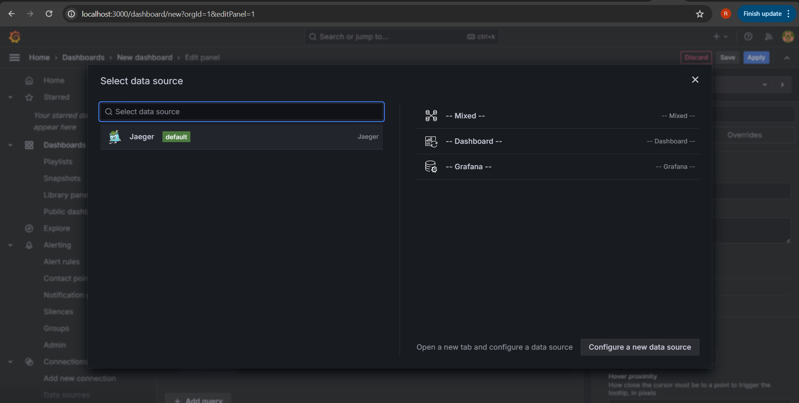

* Select Query type as Search
* Select Service Name as "godemoservice" or "pybankserve"
* And click Apply in top right corner

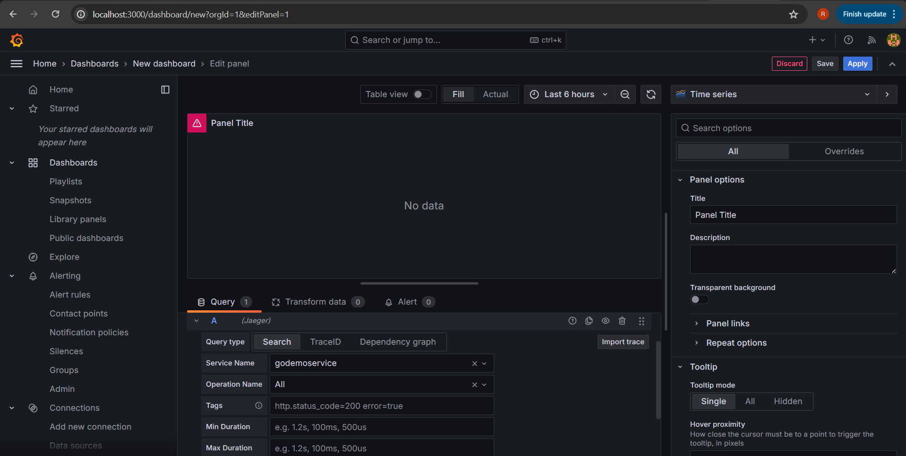

* Now you can observe and add more dashboards to the grafana UI

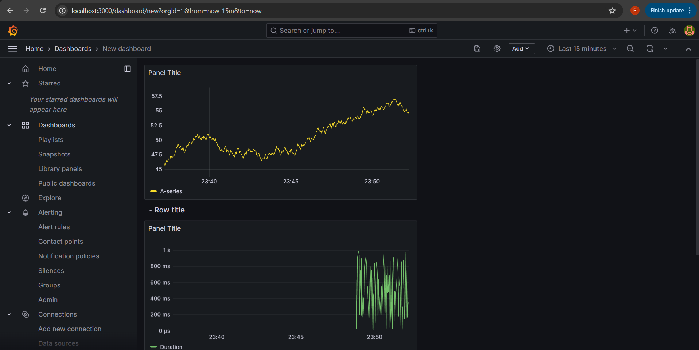

* Dashboard displaying duration of requests in different charts 

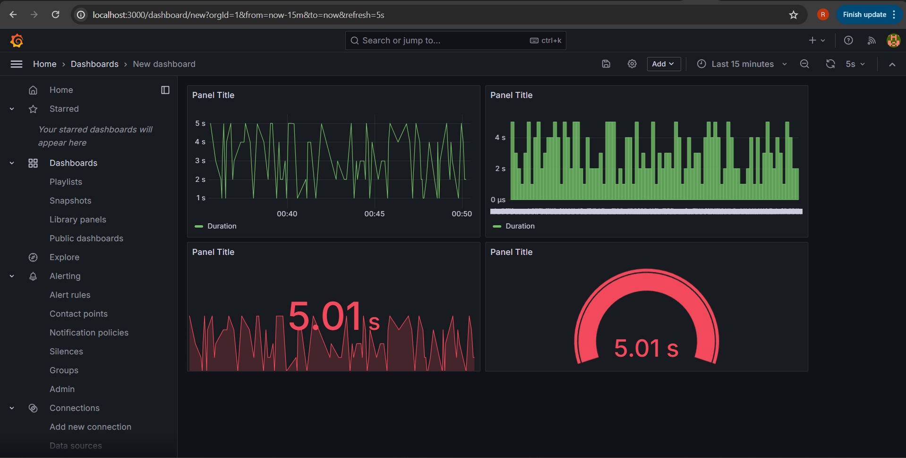


## 8. Summary – conclusions

In this project, we conducted a study to explore OpenTelemetry technology and its applications in monitoring and 
managing service environments. Key findings include:

* OpenTelemetry is a powerful tool for collecting and analyzing telemetry data, enabling performance monitoring, request
tracing, and metric collection.
* Its flexibility allows integration with various observability backends, and its architecture, based on Docker 
containers and Docker Compose, facilitates easy and scalable deployment.
* Tools like Jaeger and Grafana provide transparent monitoring and control over application operations.
* OpenTelemetry's adaptability makes it suitable for evolving application architectures and monitoring needs.

These insights lay the groundwork for further exploration and development in service environment observation and 
management using OpenTelemetry tools.

## 9. References

1. OpenTelemetry official site: https://opentelemetry.io/docs/demo/docker-deployment/
2. Grafana configuration: https://grafana.com/blog/2023/06/07/easily-monitor-docker-desktop-containers-with-grafana-cloud/
3. Jagger configuration: https://www.jaegertracing.io/docs/1.56/deployment/
4. Locust configuration: https://docs.locust.io/en/stable/configuration.html
5. Swagger: https://swagger.io/docs/open-source-tools/swagger-ui/usage/configuration/
